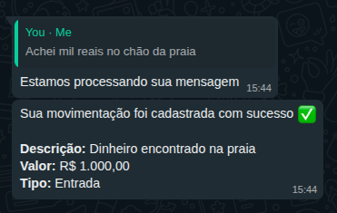

# 🕰️ Timeless

Do you often make purchases and forget to write them down? **Timeless** is a project designed to help you by automatically detecting purchase-related messages on WhatsApp and registering that data in the **Timeless** app — your personal financial organization hub.

See our landing page: [**https://timeless.platformoon.com**](https://timeless.platformoon.com)

## ✨ Overview

This application monitors WhatsApp messages for signs of purchases (such as receipts, audio messages, transfers), extracts relevant information (amounts, descriptions), and automatically sends it to **Timeless**, helping you keep your finances organized — effortlessly.

✨ Overview
This application monitors WhatsApp messages for signs of purchases (such as receipts, audio messages, transfers), extracts relevant information (amounts, descriptions), and automatically sends it to Timeless, helping you keep your finances organized — effortlessly.

⚠️ Project Intent
Timeless is primarily an educational project built to explore the intersection of automated messaging, NLP, and cloud infrastructure. While it mimics real-world financial tracking systems, its core goal is to demonstrate:

**Production-like Architecture**: Integrating Java/Quarkus with AI and external messaging APIs.

**Continuous Improvement**: The codebase is designed to evolve. We encourage experiments with local LLMs and different cloud providers.

**Learning by Doing**: This is a sandbox for implementing "real-world" logic in a controlled environment. Feel free to refactor, break, and improve!

## 🚀 Features

- 📩 Automatic reading of WhatsApp messages
- 🧠 Smart extraction of purchase data using NLP (Natural Language Processing)
- 📤 Automatic registration of purchases in Timeless (via API)

## 🛠️ Technologies Used

- **Java + Quarkus** (timeless-api)
- **Quinoa + Angular** (frontend)
- **Langchain4j + OpenAI Whisper** (audio transcription and analysis)
- **NodeJS + whatsapp-web.js** (whatsapp)

## 💡 How It Works

1. You send a message/audio/image on WhatsApp:  
   `"Transfer of R$ 120.00 successfully made to Mercadinho da Vila."`

2. The system identifies the transaction, extracts the data, and saves it into your monthly budget.

## Running with Terraform and AWS

> [!WARNING]
> Actually, you will need two phones and a OpenAI token. Feel free to change the code to support only one number and a local LLM.

If you want to use Terraform and AWS see [this tutorial](RUNNING_TERRAFORM_AWS.md).

## Running locally with localstack

> [!WARNING]
> Actually, you will need two phones and a OpenAI token. Feel free to change the code to support only one number and a local LLM.

### Execute the infrastructure

1. Go to `docker` directory

2. Run all necessary containers:

```shell
docker-compose up -d
```

### Execute the timeless-api

> [!NOTE]
> Before you start, make sure to fill the `quarkus.langchain4j.openai.api-key` and `quarkus.langchain4j.openai.gpt-4-turbo.api-key` variables in the `timeless/src/main/resources/application.properties` file.


1. Go to `timeless-api` directory and execute:

```shell
./mvnw quarkus:dev
```

2. Sign up at http://localhost:8080/sign-up

3. Sign in at http://localhost:8080

### Execute the whatsapp application

> [!NOTE]
> Before you start, make sure to fill the `ALLOWED_USERS` and `OPENAI_API_KEY` variables in the `.env.local` file. This variable determines the number of users who can interact with the bot.

1. Go to `whatsapp` directory and install all necessary packages:

```shell
npm install
```

2. Execute the application

```shell
npm run start:local
```

3. Open the WhatsApp and scan the QR Code generated


### Send a message

After connected the device with the scanned QR Code, send the following message: `"Achei mil reais no chão da praia"`.

You should receive something like it:



### How to contribute

[CONTRIBUTING.md](CONTRIBUTING.md)
