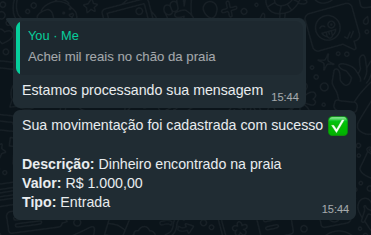

# Running with Terraform and AWS

## Creating AWS resources with Terraform

1. First of all, you need to have a AWS account configured ([with the all necessary permissions](./PERMISSIONS.md)) locally:

```shell
aws configure
```

2. Go to infrastructure directory

```shell
cd infrastructure
```

3. Create a Terraform backend config file

```shell
cat > aws-backend.conf <<EOF
bucket = "your-tfstate-bucket"
key    = "state/aws.tfstate"
region = "sa-east-1"
EOF
```

Change the `bucket`, `key` and `region` as you want.

4. Initialize the Terraform

```shell
terraform init -backend-config=aws-backend.conf
```

5. Create all resources with `terraform apply`

```shell
terraform apply -auto-approve
```

If you want, execute a `terraform plan` before.

## Configuring timeless-api (backend application)

1. Go to timeless-api directory

```shell
cd timeless-api
```

2. Create a `.env` file

```shell
cat > .env <<EOF
AWS_ACCESS_KEY_ID=
AWS_SECRET_ACCESS_KEY=
OPENAI_API_KEY=
SECURITY_KEY=
INCOMING_MESSAGE_FIFO_URL=
RECOGNIZED_MESSAGES_FIFO_URL=
EOF
```

3. Fill in all environment variables

The table below explains the purpose of each variable along with suggested example values:

| Variable                      | Description                                                                                   | Suggested Example                                             |
|-------------------------------|-----------------------------------------------------------------------------------------------|---------------------------------------------------------------|
| `AWS_ACCESS_KEY_ID`           | Your AWS Access Key                                                                           | `AKIAxxxxxxxxxxxxxxx`                                         |
| `AWS_SECRET_ACCESS_KEY`       | Your AWS Secret Access Key                                                                    | `xxxxxxxxxxxxxxxxxxxxxxxxxxxxxxxxxxxxxxxx`                    |
| `ASSETS_BUCKET`               | The name of the bucket where audio and images will be stored (created via Terraform)          | `my-assets-bucket`                                            |
| `OPENAI_API_KEY`              | Your OpenAI API key                                                                          | `sk-xxxxxxxxxxxxxxxxxxxxxxxxxxxxxxxxxxxxxxxx`                 |
| `SECURITY_KEY`                | Secret key used for AES encryption (must be exactly 16, 24, or 32 characters long, no accents) | `MySuperSecretAESKey12345678901234`                          |
| `INCOMING_MESSAGE_FIFO_URL`  | The URL of the SQS FIFO queue for incoming messages                                          | `https://sqs.us-east-1.amazonaws.com/123456789/incoming-messages.fifo` |
| `RECOGNIZED_MESSAGES_FIFO_URL`| The URL of the SQS FIFO queue for processed messages                                        | `https://sqs.us-east-1.amazonaws.com/123456789/messages-processed.fifo` |

4. Execute the application in Dev mode

```shell
./mvnw quarkus:dev -Dquarkus.profile=aws
```

5. Sign up at <http://localhost:8080/sign-up>

6. Sign in at <http://localhost:8080>

7. Add the user phone number at <http://localhost:8080/home/user-configs>, this phone number must be set after on `ALLOWED_PHONE_NUMBERS`.

## Configuring and running the whatsapp application

1. Go to `whatsapp` directory

2. Install packages

```shell
npm install
```

3. Set the following environment variables in your `.env` file:

| Variable                      | Description                                                                                       | Suggested Example                                                |
|-------------------------------|---------------------------------------------------------------------------------------------------|------------------------------------------------------------------|
| `AWS_ACCESS_KEY_ID`                  | Your AWS Access Key                                                                               | `AKIAxxxxxxxxxxxxxxxxxx`                                         |
| `AWS_SECRET_ACCESS_KEY`                  | Your AWS Secret Key                                                                               | `xxxxxxxxxxxxxxxxxxxxxxxxxxxxxxxxxxxxxxxx`                       |
| `ASSETS_BUCKET`              | The name of the bucket where audio and images will be stored (created via Terraform)                      | `my-assets-bucket`                                                 |
| `ALLOWED_PHONE_NUMBERS`                | Comma-separated list of phone numbers allowed to interact with the bot             | `5511999999999,5511888888888`                                  |
| `OPENAI_API_KEY`             | Your OpenAI API Key used to access GPT and Whisper APIs                                           | `sk-xxxxxxxxxxxxxxxxxxxxxxxxxxxxxxxxxxxxxxxxxxxxxxxx`            |
| `INCOMING_MESSAGE_QUEUE`     | URL of the SQS queue that receives incoming messages                                              | `https://sqs.us-east-1.amazonaws.com/123456789/incoming-messages.fifo`    |
| `RECOGNIZED_MESSAGES_FIFO_URL`| URL of the SQS FIFO queue where processed messages are sent                                       | `https://sqs.us-east-1.amazonaws.com/123456789/messages-processed.fifo`   |

4. Start the application

```shell
npm run start
```

3. Open the WhatsApp and scan the QR Code generated


## After configuring and running all applications

### How to Use the Application

1. Open the sign-up page at [http://localhost:8080/sign-up](http://localhost:8080/sign-up).
2. Fill out the registration form with your details and submit it.
3. Log in to your account at [http://localhost:8080](http://localhost:8080).
4. Add your phone number on the [User Configs page](http://localhost:8080/home/user-configs).  
   ⚠️ Make sure the phone number matches one of the values defined in the `ALLOWED_PHONE_NUMBERS` environment variable.
5. After connected the device with the scanned QR Code, send the following message: `"Achei mil reais no chão da praia"`.

   You should receive something like it:

   

6. Refresh the page and see your balance go negative — good luck managing your expenses!
